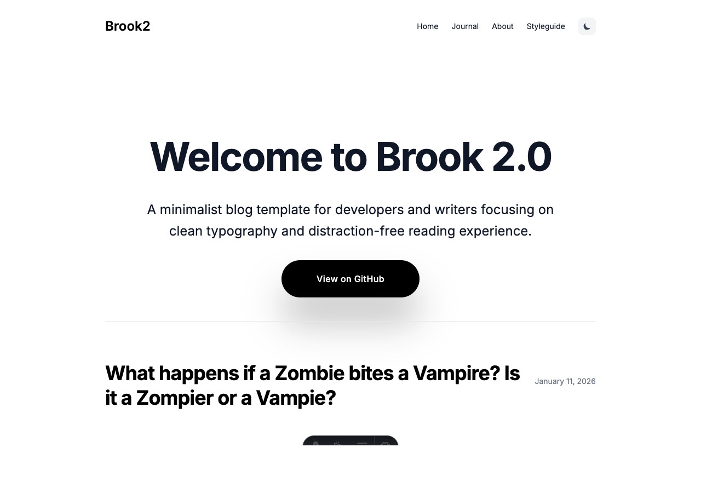

<!-- templatedeck-backlink -->
> 🎨 **BROOK 2** is part of the [TemplateDeck](https://templatedeck.com) collection — handcrafted HTML and Astro templates for developers and designers.
>
> 📥 **[Download free on TemplateDeck](https://templatedeck.com/templates/brook2)** · 🌐 **[Browse all templates](https://templatedeck.com)**

---

# Brook - A Minimalist Blog Template Built with Astro



**[Live Demo](https://brook2-astro-blog.vercel.app/)**

Brook is a minimalist blog template for developers and writers that focuses on clean typography and a distraction-free reading experience.

## ✨ Features

- **Clean Minimalist Design**: Elegant layout focused on readability and content
- **Full Dark/Light Mode**: Complete support for both modes with smooth transitions
- **Responsive Design**: Optimized for all device sizes
- **Content Collections**: Organized content using Astro's content collections
- **Markdown/MDX Support**: Write your content in Markdown with optional JSX support
- **Image Optimization**: Automatic image processing and optimization
- **View Transitions**: Smooth page transitions with Astro's view transitions API
- **Tagging System**: Categorize and filter posts using tags
- **Code Syntax Highlighting**: Beautiful syntax highlighting for code blocks
- **SEO Optimized**: Built-in meta tags and structured data (JSON-LD)
- **Type-Safe**: Fully typed with TypeScript
- **Reading Time**: Automatic calculation of estimated reading time
- **Accessible**: Built with accessibility in mind
- **Fast Performance**: Optimized for web vitals with minimal JavaScript
- **RSS Feed**: Auto-generated RSS feed

## 🚀 Getting Started

```bash
# Clone the repository
git clone https://github.com/holger1411/astro-brook.git
cd astro-brook

# Install dependencies
npm install

# Start the development server
npm run dev
```

Visit [http://localhost:4321](http://localhost:4321) to see the result.

## 📁 Project Structure

```
├── public/               # Static assets
├── src/
│   ├── assets/           # Optimized assets (images, etc.)
│   ├── components/       # Reusable components
│   │   ├── PostCard.astro      # Blog post preview card
│   │   ├── PostList.astro      # List of blog posts
│   │   ├── PostNavigation.astro # Next/previous post navigation
│   │   └── ui/                 # UI components
│   ├── content/          # Content directory (using Astro Content Collections)
│   │   └── posts/        # Blog posts (Markdown/MDX)
│   ├── layouts/          # Astro layouts
│   │   ├── BaseLayout.astro    # Base layout
│   │   └── PostLayout.astro    # Layout for blog posts
│   ├── pages/            # Astro pages
│   │   ├── about.astro         # About page
│   │   ├── index.astro         # Homepage
│   │   ├── journal.astro       # Blog overview page
│   │   ├── posts/[slug].astro    # Dynamic blog post route
│   │   └── tags/[tag].astro    # Tag-based filtering
│   ├── styles/           # Stylesheets
│   └── utils/            # Helper functions and utilities
└── astro.config.mjs      # Astro configuration
```

## 📝 Adding Content

### Creating a New Blog Post

1. Create a new `.md` or `.mdx` file in the `src/content/posts/` directory
2. Add frontmatter metadata:

```mdx
---
title: My New Blog Post
date: 2025-03-01
excerpt: A short description of the blog post
image: /images/my-image.jpg
tags: [tag1, tag2]
---

Here goes the content of the blog post.

## A Heading

More text and content...
```

### Images

For images in your blog posts:

1. Place images in the `public/images/` directory
2. Reference them in your frontmatter and content using the path `/images/my-image.jpg`

## 🎨 Customization

### Theme Customization

The color palette and other design elements can be customized in the `tailwind.config.mjs` file and `src/styles/global.css`:

```javascript
// tailwind.config.mjs
export default {
  theme: {
    extend: {
      colors: {
        // Customize colors here
      },
      typography: {
        // Typography settings
      }
    }
  }
}
```

### Layout Customization

The main layouts are located in the `src/layouts/` directory.

## 🧩 Technology Stack

- [Astro](https://astro.build/) - Modern web framework
- [TypeScript](https://www.typescriptlang.org/) - Type safety
- [Tailwind CSS](https://tailwindcss.com/) - Utility-first CSS framework
- [Astro Content Collections](https://docs.astro.build/en/guides/content-collections/) - Content management
- [MDX](https://mdxjs.com/) - Markdown with JSX (optional)

## 📦 Dependencies

- `@tailwindcss/vite` - Tailwind CSS v4 integration
- `@astrojs/mdx` - MDX support
- `@astrojs/sitemap` - Sitemap generation
- `@astrojs/rss` - RSS feed generation
- `date-fns` - Date formatting

## 🛠️ Development

```bash
# Start development server
npm run dev

# Build for production
npm run build

# Preview production build
npm run preview
```

## 🚀 Deployment

This project can be deployed on any platform that supports Astro:

- [Netlify](https://www.netlify.com/)
- [Vercel](https://vercel.com/)
- [GitHub Pages](https://pages.github.com/)
- [Cloudflare Pages](https://pages.cloudflare.com/)
- [Deno Deploy](https://deno.com/deploy)

For Netlify (recommended):

```bash
npm install -g netlify-cli
netlify deploy
```

## 🤝 Contributing

Contributions are welcome! Please follow these steps:

1. Fork the repository
2. Create a feature branch (`git checkout -b feature/amazing-feature`)
3. Commit your changes (`git commit -m 'Add some amazing feature'`)
4. Push to the branch (`git push origin feature/amazing-feature`)
5. Open a Pull Request

## 📄 License

This project is licensed under the MIT License - see the LICENSE file for details.

## ❓ Support

If you have any questions or suggestions, please open an issue or start a discussion.

---

Built with ❤️ using Astro, TypeScript, and Tailwind CSS.
